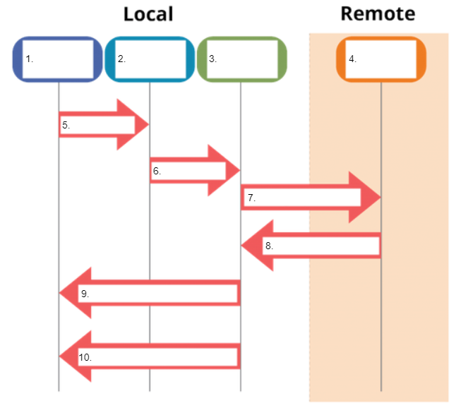

# Explain and diagram git commands

1. Complete the following diagram using the wordbank:

    

    Wordbank:
    ```
    git checkout
    local repo
    git add
    staging area
    git merge
    git push
    remote repo
    git pull
    git commit
    working directory
    ```

    ```
    1.
    2.
    3.
    4.
    5.
    6.
    7.
    8.
    9.
    10.
    ```

2. Explain what the following `git` commands do:
    ```
    git help:
    git status:
    git add <filename>:
    git commit -m "commit message":
    git log:
    git checkout -b <branch_name>:
    git pull:
    git push:
    git clone <location>:
    git reset HEAD:
    ```

## Resources
- [git](https://git-scm.com/docs/)
- [Git tutorial](https://www.edureka.co/blog/git-tutorial/)
- [Version control](https://missing.csail.mit.edu/2020/version-control/)
- [learngitbranching.org](https://learngitbranching.js.org/?locale=en_US)

[Back to README](README.md)