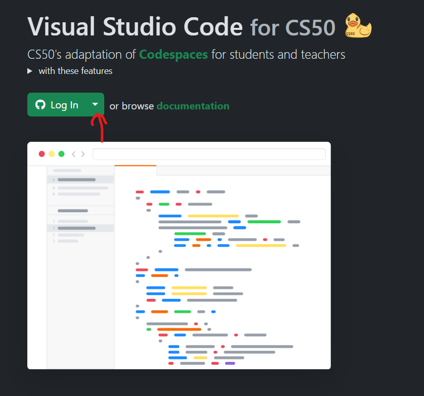

# For those new to programming, we will use Harvard's CS50 Course

The link to CS50 is here: https://cs50.harvard.edu/x/2024/weeks/

Few steps:

For the first half of the course, we will use a custom Codespace from CS50.

We will complete the following weeks:

1. Scratch
2. C
3. Arrays
4. Algorithms
5. Memory
6. Data Structures
7. Python