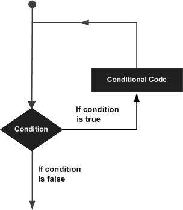

# Python Loops

[Back to README](README.md)

In general, statements are executed sequentially; the first statement in a function is executed first, followed by the second, and so on. When programming, there are often situations where we need to execute the same statement many times. We can do this using loops.

A loop statement allows us to execute a statement or group of statements multiple times. The following diagram illustrates a loop statement:



Python provides the following types of loops to handle looping requirements.


## While Loops

In python, a `while` loop is used to execute a block of statements repeatedly until a given condition is no longer satisfied. When the conditional expression evaluates to `False`, the loop is exited and the line immediately after the loop in the program is executed. The syntax of a `while` loop is very similar to the syntax of an `if` statement:

### Syntax

```python
while condition:
    statement(s)
```

For as long as `condition` evaluates to `True`, `statement(s)` will run.

### Example of a Python While Loop

In this example, a counter is intialized to 0. The condition of the loop checks to see if the counter is less than 3. The statements inside the loop will execute so long as the counter remains less than 3.

```python
count = 0
while count < 3:
    count = count + 1
    print("Hello World")
```

As a result, the message "Hello World" outputs three times, once for each time that the loop condition was satisfied. When `count == 3`, the loop condition no longer evaluates to `True` and the loop statement is terminated.

Output:
```
Hello World
Hello World
Hello World
```

### Infinite Loops

If the condition of a while loop always evaluates to `True`, then the loop will always run. We can take advantage of this to explicitly write inifinite loops like the following:

```python
while True:
    print("ha")
```

Output:
```
ha
ha
ha
ha
ha
...
```

There is also the possibility that you write an infinite loop on accident. Take a look at following code block:

```python
counter = 0
while counter < 5:
    print("beep")
```

The `while` loop in this code will run forever because its condition will always evaluate as `True`. The reason for this is that `counter` is never updated inside of the loop, so it always remains equal to 0. Logically, 0 is always less than 5, so the loop will always run.

If you execute a program and it seems to run forever, then chances are you have an infinite loop due to some condition not being updated properly!

## For Loops in Python

`for` loops are used for sequential traversal, making them excellent for traversing lists, strings, arrays, and other built-in types. A `for` loop follows the syntax:

### Syntax

```python
for iterator in sequence:
    statement(s)
```

An *iterator* is an object in Python that represents a stream of data and is used to traverse through a *sequence* of elements one at a time. The main purpose of an iterator is to provide a consistent and efficient way to loop through elements of a sequence, regardless of whether that sequence is a list, tuple, string, dictionary, or any other iterable data structure.

### Example of a Python For Loop

Here is a simple example of using a `for` loop to print each number in a list:

```python
numbers = [0, 1, 2, 3]
for i in numbers:
    print(i)
```

Output:
```
0
1
2
3
```

Python `for` loops can also be used to iterate over a range of numbers. The `range()` function below takes a lower bound (inclusive) and an upper bound (exclusive) to generate a sequence of numbers such that each number `n` is between `0 <= n < 4`. As a result, the sequence `0, 1, 2, 3` is generated. We then iterate through the sequence to print each number to the screen.

```python
n = 4
for i in range(0, n):
    print(i)
```

Output:
```
0
1
2
3
```

In this example, we effectively use the `range()` function to create a list of numbers like the list in the `for` loop example. As a result, the output of the two examples are identical because the `for` loops are iterating through the same sequence.

### Using `for` loops to iterate through data

We can use `for` loops to iterate through data stored in lists, tuples, strings, dictionaries, and sets in Python. 

#### List Example

A `for` loop can iterate through every element in a list:

```python
print("List Iteration")
l = ["Welcome", "to", "N7 training"]
for i in l:
    print(i)
```

Output:
```
List Iteration
Welcome
to
N7 training
```

#### Tuple Example

A `for` loop can iterate through every element in a tuple:

```python
print("Tuple Iteration")
t = ("at", "NBP", "420")
for i in t:
    print(i)
```

Output:
```
Tuple Iteration
at
NBP
420
```

More information on how you can use lists and tuples in your Python code is given in [1.12_lists_tuples_and_sets](../1.12_lists_tuples_and_sets/README.md).

#### String Example

A `for` loop can iterate through every character in a string:

```python
print("String Iteration")
s = "sailor"
for i in s:
    print(i)
```

Output:
```
String Iteration
s
a
i
l
o
r
```

#### Dictionary Example

A `for` loop can iterate through every key in a dictionary:

```python
print("Dictionary Iteration")
d = dict()
d['xyz'] = 123
d['abc'] = 345
for i in d:
    print(f"key: {i}, value: {d[i]}")
```

Output:
```
Dictionary Iteration
key: xyz, value: 123
key: abc, value: 345
```

#### Set Example

A `for` loop can iterate through every member of a set:

```python
print("Set Iteration")
set1 = {1, 2, 3, 4, 5, 6}
for i in set1:
    print(i)
```

Output:
```
Set Iteration
1
2
3
4
5
6
```

### Iterating by Index using a Sequence

In some cases it is beneficial to have the index of a value in a sequence in addition to the value itself, like if we ever wanted to change the value of a list at some index. We can gather both an index and a value using Python's `enumerate` function. This function will return an `enumerate` object which is essentially a list of tuples containing both indices and values. The following code shows how we can combing a `for` loop and `enumerate`:

```python
lst = ["dog", "cat", "mouse"]
for index, value in enumerate(lst):
    print(f"Index in list: {index}; Value: {value}")
```

Output:

```
Index in list: 0; Value: dog
Index in list: 1; Value: cat
Index in list: 2; Value: mouse
```

Combining `enumerate` with `for` loops is a powerful and more readable way to access the indices and values of a sequence.

Another method you might see of iterating throug a list using an index is with `range` and `len`. The idea is to first calculate the length of the object to be used as the upper bound for a sequence, then to use that sequence to iterate through each element. In the code below, we use `range` to generate this sequence. If we only give the `range` function the length of our list (3), then `range` will use this as an upper bound (exclusive) and assume a lower bound of 0 (inclusive). The numbers generated will be `0, 1, 2` which can be used to index into the list for all its elements.

```python
lst = ["dog", "cat", "mouse"]
for index in range(len(lst)):
    print(lst[index])
```

Output:
```
dog
cat
mouse
```

You may come across this method for looping when searching through code on the internet, but it is less powerful than using `enumerate`. In your own code, you should try to always make use of `enumerate` if you need to use indices with your `for` loops.

## Nested Loops in Python

A nested loop is a loop inside a loop. The "inner loop" will be executed one time for each iteration of the "outer loop":

### Example of a nested `for` loop

Print each adjective for every fruit:

```python
adj = ["red", "big", "tasty"]  
fruits = ["apple", "banana", "cherry"]

for x in adj:  
  for y in fruits:  
    print(x, y)
```

Output:
```
red apple
red banana
red cherry
big apple
big banana
big cherry
tasty apple
tasty banana
tasty cherry
```

The use of nested loops is useful for iterating though multi-dimensional objects like 2-D lists. Nested loops are also common in sorting and searching algorithms.

## Loop Control Statements

Loop control statements change execution from its normal sequence. Loop control statements can be combined to achieve specific desired behavior from loops.

Python supports the following control statements:
- `break`
- `continue`
- `pass`

### Break Statement

The `break` statement in Python brings control out of the loop. In other words, the loop will terminate and the program will resume execution at the first statement after the loop's code block.

```python
# Exits the loop statement if the iterator becomes
# the characters 'e' or 's'
for letter in 'abcdefghijklmnopqrstuvwxyz':
    if letter == 'e' or letter == 's':
        break
    print('Current Letter: ', letter)
print('Break out at: ', letter)
```

Output:
```
Current Letter: a
Current Letter: b
Current Letter: c
Current Letter: d
Break out at: e
```

### Continue Statement

The `continue` statement in Python returns the control to the beginning of the loop, meaning the loop will immediately recheck its condition and begin a new iteration.

```python
# Prints all characters in the string EXCEPT for
# the characters 'e' and 's'
for letter in 'geeksforgeeks':
    if letter == 'e' or letter == 's':
        continue
    print('Current Letter :', letter)
```

Output:
```
Current Letter : g
Current Letter : k
Current Letter : f
Current Letter : o
Current Letter : r
Current Letter : g
Current Letter : k
```

### Pass Statement

We use `pass` in Python to write empty loops. Pass is also used for empty control statements, functions and classes. 

```python
for letter in 'geeksforgeeks':
    pass
print('Last Letter :', letter)
```

## Recap
After reading this, you should have a basic understanding of:
- `while` Loops
- Infinite Loops
- `for` Loops
- How to iterate through lists, strings, tuples, and other built-in types
- Loop control statements like `break` and `continue`

## Sources
- [GeeksforGeeks | Loops](https://www.geeksforgeeks.org/loops-in-python/)

[Back to README](README.md)