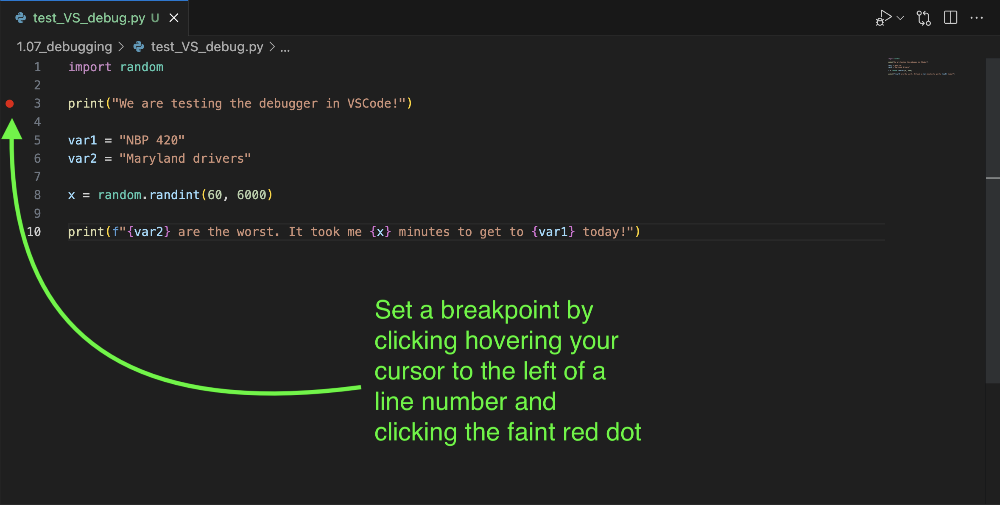
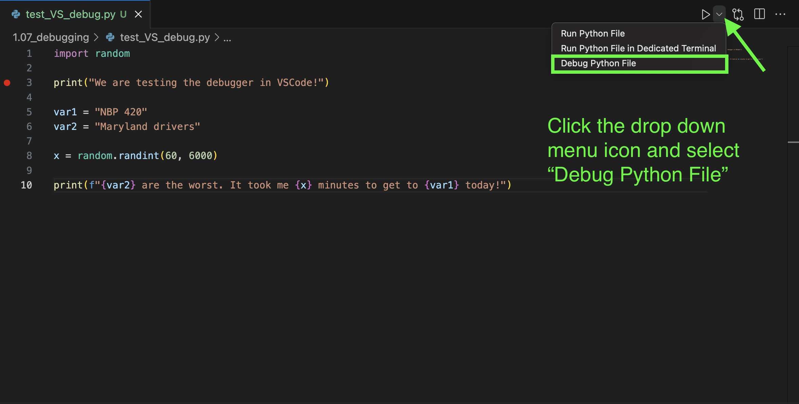
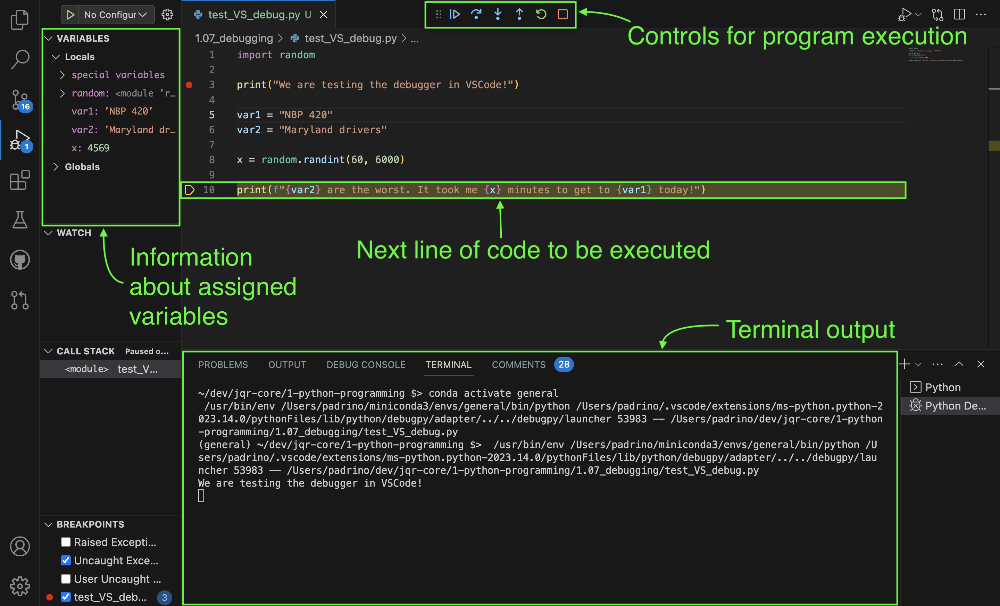

# Python Debugging

[Back to README](README.md)

More often than not, your Python code will crash when you go to run it for the first time. Even experienced developers writing simple programs can have flaws in their code which cause crashes or unexpected behaviors. However, we can get our programs to behave the way we want them to through debugging, which is the process of figuring out and correcting the logical flaws that cause the program to deviate in the first place.

## Print Statement Debugging

Print statement debugging is a simple and commonly used technique for debugging code in Python. It involves inserting print statements at strategic points in your code to observe and analyze the values of variables, function outputs, or other relevant information during runtime. By printing out these values, you can gain insights into the program's behavior and identify potential issues or unexpected behavior.

To show where print statement debugging may come in handy, take a look at the following code which takes input from a user using the `input()` function and attempts to perform an arithmetic operation. The `input()` function stops the execution of the program until the users types something and presses 'enter' on the keyboard. You can also use it like in the code below, where `input()` takes a string which gets printed to the screen before the program stops.

```python
x = input("Enter a number for x: ")     # user enters '10'
y = input("Enter a number for y: ")     # user enters '5'
z = x / y
print("Result of division: ", z)
```

Output:

```
TypeError: unsupported operand type(s) for /: 'str' and 'str'
```

The program crashes when division is attempted due to operand types not being supported for division even though the user  enters numerical input when prompted. Adding in some print statements to learn more about the variables' values and their types can be helpful. In the example below, we use a print statement to check the value of `x` along with its type using the `type()` function. The `type()` function is useful for sanity checking that a value is what you expect it to be (for example, making sure that you are working with an float rather than an integer).

```python
x = input("Enter a number for x: ")     # user enters '10'
y = input("Enter a number for y: ")     # user enters '5'
print(x, type(x))   # debug
print(y, type(y))   # debug
z = x / y
print("Result of division: ", z)
```

Output:

```
10 <class 'str'>
5 <class 'str'>
TypeError: unsupported operand type(s) for /: 'str' and 'str'
```

Now the error message makes more sense; the values of `x` and `y` are indeed numerical, but they are still being interpreted as strings after being entered as input. Python is throwing an error because it does not know how to perform division on strings.

As seen in the code block below, casting the user's input as integers would be the solution the get the script working. Casting is covered in more detail in module [1.11_typecasting](../1.11_typecasting/typecasting.md).

```python
x = int(input("Enter a number for x: "))     # user enters '10'
y = int(input("Enter a number for y: "))     # user enters '5'
print(x, type(x))    # debug
print(y, type(y))    # debug
z = x / y
print("Result of division: ", z)
```

Output:

```
10 <class 'int'>
5 <class 'int'>
Result of division: 2.0
```

Here are some key aspects and benefits of print statement debugging:

- **Ease of use:** Print statement debugging is straightforward and requires minimal setup. You can simply add print statements to your code wherever you need to inspect variables or track the program's execution flow.

- **Real-time information:** With print statements, you can observe variable values, function outputs, or any custom messages directly in the console or log output as the program runs. This allows you to see the state of the program at different stages and understand how values change over time.

- **Non-intrusive approach:** Print statement debugging does not require specialized tools or extensive modifications to your codebase. It can be easily added and removed as needed, making it a convenient choice for quick debugging tasks or understanding specific code sections.

- **Versatility:** You can customize your print statements to provide context, timestamps, or additional information to aid in debugging. This flexibility allows you to tailor the output based on the specific requirements of the problem you're debugging.

While print statement debugging can be effective for simple debugging scenarios, it may not be the most efficient or scalable approach for complex projects or situations where you need more advanced debugging capabilities. In such cases, using a dedicated debugger or integrated development environments (IDEs) with debugging features can provide additional tools and insights to diagnose and solve issues more efficiently.

## The Python Debugger (pdb)

The Python debugger, often referred to as **pdb** (Python Debugger), is a built-in module in Python that provides a powerful and interactive debugging environment. It allows you to step through your code, inspect variables, set breakpoints, and perform various debugging operations to analyze and resolve issues in your Python programs.

Key features and functionalities of the Python debugger include:

- **Breakpoints:** You can set breakpoints at specific lines in your code, pausing program execution when it reaches those points. This allows you to examine the program's state and variables at that particular moment.

- **Stepping through code:** The debugger provides several stepping commands to navigate through your code. You can step line-by-line (next), step into function calls (step), step out of the current function (return), or jump to the next breakpoint (continue).

- **Variable inspection:** At any point during program execution, you can inspect the values of variables, expressions, or even the call stack. This helps you understand the state of your program and diagnose issues.

- **Interactive debugging:** The Python debugger (pdb) runs in an interactive console mode, allowing you to execute commands dynamically while the program is paused. You can modify variables, execute code snippets, or run additional queries to gather information.

- **Post-mortem debugging:** You can invoke the debugger after an unhandled exception occurs (pdb.post_mortem). It provides a post-mortem debugging session, allowing you to inspect the program's state when the exception was raised.

The Python debugger can invoked in several ways:

One way involves importing the `pdb` module to the top of your Python script, then setting a breakpoint (`pdb.set_trace()`) at the place in your code where you would like to pause execution and start debugging.

```python
import pdb          # importing the Python Debugger

pdb.set_trace()     # Setting a breakpoint
x = 10
y = 5
z = x / y
print(z)
```

You can then run your Python program as you normally would. When the program reaches the breakpoint, it will pause, and you will enter the interactive debugging session. You can use various commands to navigate, inspect variables, and perform debugging operations.

Another option is to run the `pdb` library module as a script using the python intepreter. On the command line, this would look like:

```
python -m pdb <your_script_here.py>
```

Here are some common pdb commands you can use within the debugger session:

- `b <line>` (break): Set a breakpoint at a line using a line number.
- `n` (next): Execute the next line of code.
- `s` (step): Step into the next function call.
- `r` (return): Continue execution until the current function returns.
- `c` (continue): Continue execution until the next breakpoint or program completion.
- `l` (list): Show the current code context around the current line.
- `p` (print): Print the value of a variable or expression.
- `whatis` : Show the type of a variable or expression.
- `h` (help): Get help on available pdb commands.
- `q` (quit): Exit the interactive debugging session.

Using the same script from earlier (now referred to as `divide.py`), we can achieve similar results to our print statement debugging example using `pdb`:

**`divide.py`**
```python
x = input("Enter a number for x: ")     # user enters '10'
y = input("Enter a number for y: ")     # user enters '5'
z = x / y
print("Result of division: ", z)
```

Instead of adding the the `pdb` import and breakpoint to our code, we can invoke the debugger on the command line for the `divide.py` script with the following:

```
python -m pdb divide.py
```

Then, our interactive debugger session might look like:

```
> ./mypy.py(1)<module>()
-> x = input("Enter a number for x: ")     # user enters '10'
(Pdb) next
10

> ./mypy.py(2)<module>()
-> y = input("Enter a number for y: ")     # user enters '5'
(Pdb) next
5

> ./mypy.py(3)<module>()
-> z = x / y

(Pdb) p x
'10'

(Pdb) p y
'5'

(Pdb) whatis x
<class 'str'>

(Pdb) whatis y
<class 'str'>
```

While the example above is relatively simple, the Python debugger provides an interactive and powerful way to debug Python programs, helping you identify and resolve issues more efficiently. It's a valuable tool for both novice and experienced developers working on debugging and troubleshooting Python code.

Debugging in general is a difficult skill to pick up. New programmers might get the impression that their seniors are absolute wizards for being able to spot bugs in programs, but debugging can even be difficult for seasoned programmers. The reality is that you will get better at debugging as you make mistakes in writing code. As you experience all of the different ways that a program can crash, you gain knowledge about things that work and things that don't. Do not get discouraged. There are plenty of resources available to you online to help you (like the ones linked at the bottom of this page). Most of all, your peers can help you. Having a someone who can look at your code from a different perspective may be what you need to find and fix bugs.

## Extra: Debugging Python in VSCode

Depending on your development environment, you may have other options for debugging.

If you are using VSCode to write in Python, you can use it to debug your code. The debugger in VSCode has very similar functionality to PDB, however it is more user friendly because it uses the panes and buttons on the VSCode Window to provide debugging information and functionality.

To debug a Python script, follow these instructions:

1. Open the Python file you are debugging and set a breakpoint at the line number where you want the debugger to stop the program at.



2. In the top right corner of the VSCode window, click the drop-down menu next to the 'Play' button and select `Debug Python File`.



3. Use the buttons at the top of the VSCode window to resume code execution in the manner that you need (continue, step over, step into, etc.). You also view terminal output at the bottom of the window, and information about variables and function calls on the left-side panes.



The above is just a basic intro to debugging Python with VSCode. More information on VSCode debugging for Python can be found [here](https://code.visualstudio.com/docs/python/debugging).

## Resources
- [YouTube | PDB debugging by Real Python](https://www.youtube.com/watch?v=bHx8A8tbj2c)
- [YouTube | PDB debugging by Patrick Loeber](https://www.youtube.com/watch?v=aZJnGOwzHtU)
- [VSCode | Debugging Python](https://code.visualstudio.com/docs/python/debugging)

## Sources
- [TutorialsPoint | The Python Debugger](https://www.tutorialspoint.com/the-python-debugger-pdb)

[Back to README](README.md)