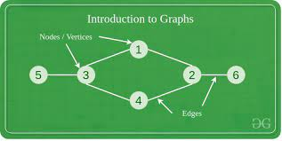

# Python Data Structures

A data structure is a data organization, management, and storage format that is chosen for efficient and reliable access to your stored data. 

This module will cover the following data structures, with in depth explanations and examples for each one.

- Array
- Stack
- Binary Search Tree
- Graph
- Linked List

## Array

An array is a collection of elements of the same memory size and data type identified by a unique position within the array. 

Think of this as your grocery list. Each item on the grocery list is indexed at its offset within the overall list. 

Example: Your grocery list looks like this:

```sh
    Fish
    Eggs
    Milk
    Bread
    Fruits
```

Like almost all other important computer science topics, arrays similarly follow _0-Indexing_. If the top of the list is the start, then `Fish` would be at the 0th index, while `Fruits` would be at the 4th. 

Arrays can be dynamic or static. Dynamic arrays can be resized to fit more elements, while static cannot be resized. Static arrays are a constant size throughout program execution. 

## Stack

Stacks are a form of data structure which relies on the previous _Array_ structure.

In computer science, the stack is conceptually the same as a stack of dishes. You can place dishes on top of the stack, and can only take from the top of the stack. You cannot take the bottom element of the stack while other elements are "stacked" on top of it. 

Think of implementing this data structure as a list which always points to the most recent item added at the "top" of the stack. You can look at the top element, remove it from the stack and shift the top pointer to the next available element, or stack more elements on top of it. When you add to a stack, the top pointer is shifted to now point at the newly added element. 

Example: You are adding the following elements to an empty stack, in the following order:
> Apples

> Bananas

> Carrot

> Dragon Fruit

At each stage, your stack would look as follows:
```sh
    Top --> Apples
    ______________

    Top --> Bananas
            Apples
    ______________

    Top --> Carrot
            Bananas
            Apples
    ______________

    Top --> Dragon Fruit
            Carrot
            Bananas
            Apples
```
You add elements to the top of the element using a _Push_ function, and remove the top element with a _Pop_ function.

When implementing a stack, you cannot _pop()_ from an empty list. Check the top of the list using a _peek()_ function before popping!

## Binary Search Tree

The Binary Search Tree data structure is a comparison-ordered storage structure. It allows you to store elements as "children" of the element they are being compared to.

Elements within the Binary Tree are called nodes. Child Nodes are stored in the structure through comparison to a parent node. If the element in comparison is less than the parent node, it will be stored to the left of the parent node. If it is greater than the parent, it will be stored as the right child. 

Example: We initialize our list with the number 21, and want to store the following numbers in our Binary Tree rooted with 21.

Examples will be provided for each insertion.

We want to add the numbers: 5, 31, 87, 96, 3, 16
After initializing our Binary Search Tree with the number 21, we have the following:

```
    21
```

Our first number in comparison is 5. Because 5 is less than 21, and the left child node of 21 is null, 5 will be stored as the left child node of 21.
After this insertion, we have the following:

``` 
    21
   /
  5
```
Our second number in comparison is 31. 31 is greater than 21, and the right child node of 21 is null. 31 will be inserted as the right child node of 21.
After this insertion, we have the following.
``` 
    21
   /  \
  5    31
```

When the child nodes are not null, you will compare the element in question to the child node. The following example will illustrate. 

``` 
      21
     /  \
    5    31
           \ 
            87
```
``` 
      21
     /  \
    5    31
           \ 
            87
              \
               96
```
``` 
      21
     /  \ 
    5    31
   /       \ 
  3         87
              \
               96
```
``` 
      21
     /  \ 
    5    31
   /  \    \ 
  3   16    87
              \ 
               96
```

BLUF: [More on BST's](https://www.youtube.com/watch?v=pYT9F8_LFTM)

## Graph

A graph is a non-linear data structure consisting of nodes and edges. Nodes represent your stored data element. Edges represent a connection between two nodes. 
Graphs can be directed (edges which have directionality) or undirected (edges can be traversed both directions). Graphs can also be weighted (a value which represents the cost of taking an edge) or unweighted (constant cost of taking any edge).



BLUF: [Watch this video for the best explanation](https://www.youtube.com/watch?v=gXgEDyodOJU_)

## Linked List

A linked list is a linear data structure which is used to store an indeterminate amount of information. 

Your data is stored in the linked list as a `node` The Node structure contains your data, and a pointer to the next node in the series. When you initialize each Node, `next` will be NULL until another element is added in series. 

Example: You want to create a linked list of the following data values. In this implementation, the Node data field is of type `string`.

> Tuna, mackerel, Mola Mola, Cobia 

Each step of these insertions will be visualized.

```
    Node Head - Data=NULL
                NEXT=NULL
    ______________________  ^ Empty linked list
    Node Head - Data=TUNA
                NEXT=NULL
    ______________________  ^ Tuna added into the list
    Node Head - Data=Tuna
                NEXT=NODE2
    Node NODE2- Data=Mackerel
                NEXT=NULL
    ______________________  ^ Mackerel added into the list
    Node Head - Data=Tuna
                NEXT=NODE2
    Node NODE2- Data=Mackerel
                NEXT=NODE3
    Node NODE3- Data=Mola Mola
                NEXT=NULL
    ______________________  ^ Mola Mola added into the list
    Node Head - Data=Tuna
                NEXT=NODE2
    Node NODE2- Data=Mackerel
                NEXT=NODE3
    Node NODE3- Data=Mola Mola
                NEXT=NODE4
    Node NODE4- Data=Cobia
                NEXT=NULL
    ______________________  ^  Cobia added into the list
```

Danger of implementation: Make sure to keep track of memory addresses when implementing, using, and modifying linked lists. Proper usage requires that you do not overwrite and lose memory addresses unless you do so intentionally. 
[Graph with Edges and Vertices](image.png)
BLUF: [More on Linked Lists](https://www.youtube.com/watch?v=R9PTBwOzceo)

[Back to README](README.md)