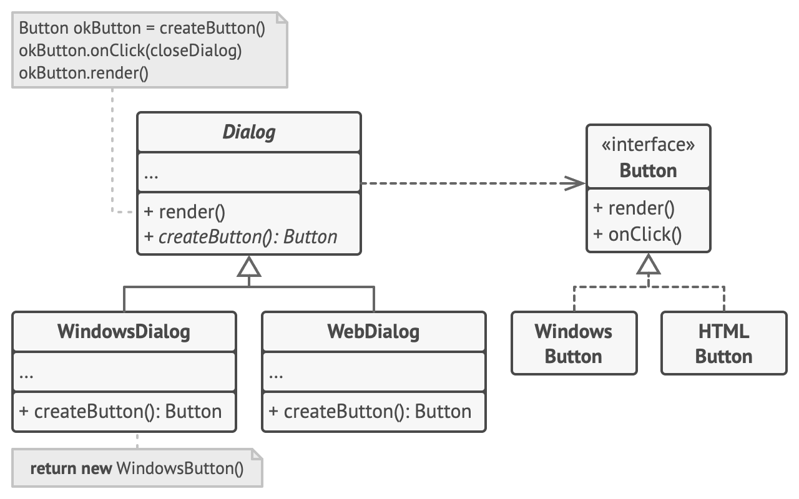
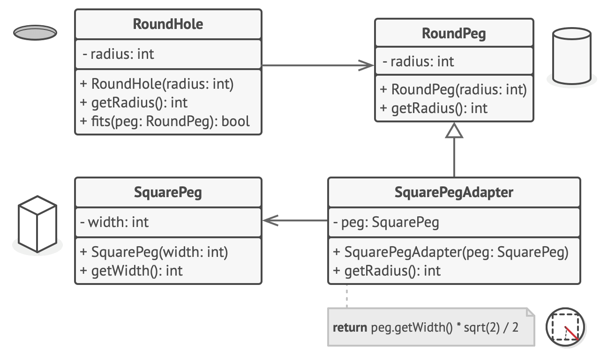
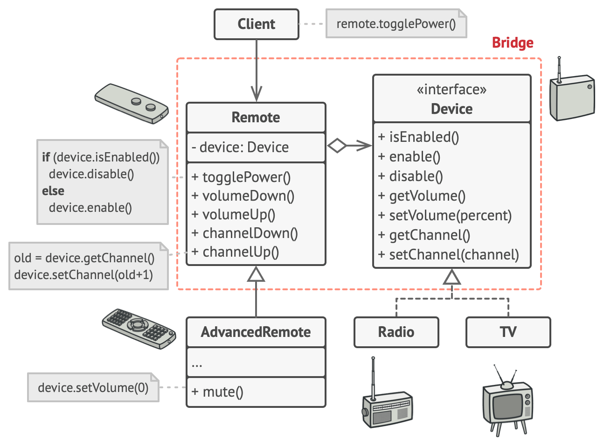

# Python Design Patterns

[Back to README](README.md)

> The general outline for this module follows the [refactoring.guru design pattern article](https://refactoring.guru/design-patterns). It has been condensed and tweaked to teach the Factory, Singleton, Adapter, and Bridge design patterns.

In software engineering, a **design pattern** is a general repeatable solution to a commonly occurring problem in software design. A design pattern isn't a finished design that can be transformed directly into code. It is a description or template for how to solve a problem that can be used in many different situations.

Design patterns can speed up the development process by *providing tested, proven development paradigms*. Effective software design requires considering issues that may not become visible until later in the implementation. Reusing design patterns helps to prevent subtle issues that can cause major problems and improves code readability for coders and architects familiar with the patterns.

If you learn more by watching videos, each design pattern covered below will contain a link to its respective video in [Derek Banas' "Design Patterns Video Tutorial"](https://www.youtube.com/playlist?list=PLF206E906175C7E07) YouTube series.


## Creational design patterns

These design patterns are all about class instantiation. This pattern can be further divided into class-creation patterns and object-creational patterns. While class-creation patterns use inheritance effectively in the instantiation process, object-creation patterns use delegation effectively to get the job done.

There are many creational design patterns, but we will be focusing on the Factory Method and Singleton ones.

### Factory

If you prefer video learning, you can check out the [Factory Design Pattern](https://www.youtube.com/watch?v=ub0DXaeV6hA&list=PLF206E906175C7E07&index=5) video on YouTube.

Not to be confused with the [Abstract Factory](https://refactoring.guru/design-patterns/abstract-factory) design pattern, the [Factory Method](https://refactoring.guru/design-patterns/factory-method) is a creational design pattern that *provides an interface for creating objects in a superclass, but allows subclasses to alter the type of objects that will be created*.

**When to use**:
- When you don’t know beforehand the exact types and dependencies of the objects your code should work with.
- When you want to provide users of your library or framework with a way to extend its internal components.
- When you want to save system resources by reusing existing objects instead of rebuilding them each time.

**Pros**:
- You avoid tight coupling between the creator and the concrete products.
- *Single Responsibility Principle*
  - You can move the product creation code into one place in the program, making the code easier to support.
- *Open/Closed Principle*
  - You can introduce new types of products into the program without breaking existing client code.

**Cons**:
- The code may become more complicated since you need to introduce a lot of new subclasses to implement the pattern. The best case scenario is when you’re introducing the pattern into an existing hierarchy of creator classes.


*A cross-platform UI dialog generating example.*

More python code examples can be seen on the [Factory Method in Python](https://refactoring.guru/design-patterns/factorysingleton/python/example) article.

### Singleton

If you prefer video learning, you can check out the [Singleton Design Pattern Tutorial](https://www.youtube.com/watch?v=NZaXM67fxbs&list=PLF206E906175C7E07&index=7) video on YouTube.

Arguably the design pattern you're most likely to use, the [Singleton pattern](https://refactoring.guru/design-patterns/singleton) *ensures that a class has only one instance and provides a global point of access to that instance*. 

**When to use**:
- When a class in your program should have just a single instance available to all clients
  - e.g. A single database object shared by different parts of the program, all doing queries on it
- When you need stricter control over global variables.

**Pros**:
- You can be sure that a class has only a single instance.
- You gain a global access point to that instance.
- The singleton object is initialized only when it’s requested for the first time.

**Cons**:
- The pattern requires special treatment in a multithreaded environment so that multiple threads won’t create a singleton object several times.
- It may be difficult to unit test the client code of the Singleton because many test frameworks rely on inheritance when producing mock objects.


A classic example can be seen below:
```python
class SingletonClass(object):
  # The magic occurs here, where the __new__ dunder method 
  # ,which is called during construction, is overwritten.
  # The `instance` member is only initialized once. Every other constructor
  # call returns the same original object.
  def __new__(cls):
    if not hasattr(cls, 'instance'):
      cls.instance = super(SingletonClass, cls).__new__(cls)
    return cls.instance
   
singleton = SingletonClass()
new_singleton = SingletonClass()
 
print(singleton is new_singleton)       # test identity with id()
 
singleton.singl_variable = "My singleton var!!"
print(new_singleton.singl_variable)     # using new_singleton, not singleton
```

Running that code outputs:
```
True
My singleton var!!
```

This is only a brief introduction. Check out [GeeksforGeeks - Singleton Patterns](https://www.geeksforgeeks.org/singleton-pattern-in-python-a-complete-guide/) for more in-depth learning, including a section on why Python Modules are considered singletons!

More python code examples can be seen on the [Singleton in Python](https://refactoring.guru/design-patterns/singleton/python/example) article.


## Structural design patterns

These design patterns are all about Class and Object composition. Structural class-creation patterns use **inheritance** to compose **interfaces**. Structural object-patterns define ways to compose objects to obtain new functionality.

There are many structural design patterns, we will focus on the Bridge and Adapter ones.

### Adapter

If you prefer video learning, you can check out the [Adapter Design Pattern](https://www.youtube.com/watch?v=qG286LQM6BU&list=PLF206E906175C7E07&index=13) video on YouTube.

The [Adapter structural design pattern](https://refactoring.guru/design-patterns/adapter) allows objects with incompatible interfaces to collaborate.

**When to use**:
- When you want to use some existing class, but its interface isn't compatible with the rest of your code.
- When you want to reuse several existing subclasses that lack some common functionality that can't be added to the superclass.

**Pros**:
- *Single Responsibility Principle*
  - You can separate the interface or data conversion code from the primary business logic of the program.
- *Open/Closed Principle*
  - You can introduce new types of adapters into the program without breaking the existing client code, as long as they work with the adapters through the client interface.

**Cons**:
-  The overall complexity of the code increases because you need to introduce a set of new interfaces and classes.


*Adapting square pegs to round holes using the `SquarePegAdapter` class.*

### Bridge

If you prefer video learning, you can check out the [Bridge Design Pattern](https://www.youtube.com/watch?v=9jIgSsIfh_8&list=PLF206E906175C7E07&index=15) video on YouTube.

The [Bridge pattern](https://refactoring.guru/design-patterns/bridge) *decouples an abstraction from its implementation, so that the two can vary independently*. It lets you split a large class or a set of closely related classes into two separate hierarchies, *abstraction and implementation*, which can be developed independently of each other. 

**When to use**:
- When you want to divide and organize a monolithic class that has several variants of some functionality
  - e.g. A database interface class that can work with various database servers (MySQL, MSSQL, Sqlite, etc) which all require different implementations
- When you need to extend a class in several orthogonal (independent) dimensions
- When you need to be able to switch implementations at runtime

**Pros**:
- You can create platform-independent classes and apps
- The client code works with high-level abstractions. It isn’t exposed to the nitty gritty platform details
- *Open/Closed Principle*
  - You can introduce new abstractions and implementations independently from each other.
- *Single Responsibility Principle*
  - You can focus on high-level logic in the abstraction and on platform details in the implementation.

**Cons**:
- You might make the code more complicated by applying the pattern to a highly cohesive class
  


*The original class hierarchy is divided into two parts: devices and remote controls.*

## Resources

- [RefactoringGuru | Abstract Factory](https://refactoring.guru/design-patterns/abstract-factory)
- [RefactoringGuru | Factory Method in Python](https://refactoring.guru/design-patterns/factorysingleton/python/example)
- [RefactoringGuru | Singleton in Python](https://refactoring.guru/design-patterns/singleton/python/example)
- [YouTube | Design Patterns Video Tutorial](https://www.youtube.com/playlist?list=PLF206E906175C7E07)
- [GeeksforGeeks | Singleton Patterns](https://www.geeksforgeeks.org/singleton-pattern-in-python-a-complete-guide/)

## Sources

- [RefactoringGuru | Design Pattern Article](https://refactoring.guru/design-patterns)
- [RefactoringGuru | Factory Method](https://refactoring.guru/design-patterns/factory-method)
- [RefactoringGuru | Singleton pattern](https://refactoring.guru/design-patterns/singleton)
- [RefactoringGuru | Adapter structural design pattern](https://refactoring.guru/design-patterns/adapter)
- [RefactoringGuru | Bridge pattern](https://refactoring.guru/design-patterns/bridge)

[Back to README](README.md)