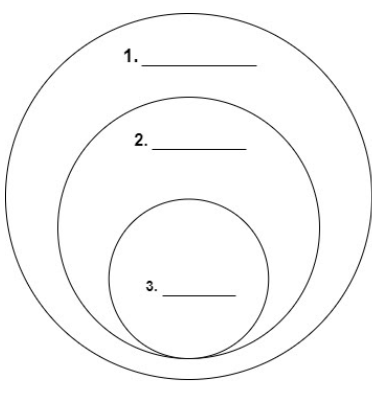

# Explain Python modules and the idea of a namespace

- What is namespace in Python?

    ```text
  ANSWER:
  ```

- How does this relate to modules?

    ```text
  ANSWER:
  ```

- Number the 3 types of Python namespaces according to the diagram.

    ```text
       Local:
      Global:
    Built-in:
    ```

  

- What are the differences between the three namespaces?

    ```text
  local:
  global:
  built-in:
  ```

- The user has two files within the same directory (`struct.py` and `my_struct.py`).  If `my_struct.py` imports the module `struct`, will Python’s native `struct` module or my user-defined `struct` module be used? (Hint: try it)

    ```text
    ANSWER:
    ```


Reference:

- [Module](https://docs.python.org/3/tutorial/modules.html)

- [Namespace](https://code.tutsplus.com/tutorials/what-are-python-namespaces-and-why-are-they-needed--cms-28598)
