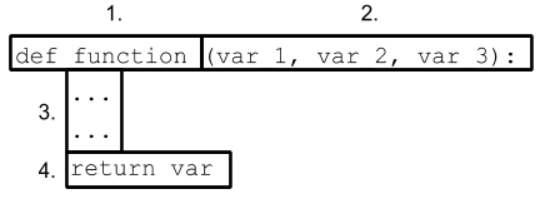

# Explain and demonstrate usage of functions

- What is a function?

    ```text
  ANSWER:
  ```

- Breakdown the individual components of the following function.

  

  ```text
  1:
  2:
  3:
  4:
  ```

- What types of variables can be returned from a function in Python? Can you return multiple values ? How?

  ```text
  ANSWER:
  ```

- How would you call this function?

  ```text
  ANSWER:
  ```


Reference:

- Python Crash Course 2nd Edition, Eric Matthes (Chapter 8)
- [Functions](https://www.learnpython.org/en/Functions)
