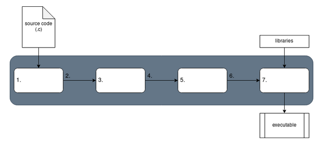

# Explain the stages of compilation for a C program

[Back to OVERVIEW](../README.md)

- Complete the diagram for the stages of compilation.  Explain what each stage does.  Indicate the file extension produced by each stage.



```text
1.
2.
3.
4.
5.
6.
7.
```

Resources:

- [C compilation process I](https://codeforwin.org/2017/08/c-compilation-process.html)

- [C compilation process II](https://www.calleerlandsson.com/the-four-stages-of-compiling-a-c-program/)

[Back to OVERVIEW](../README.md)
