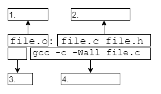

# Explain Makefiles

- What is the purpose of a Makefile?

```text
ANSWER:
```

- Complete the diagram using the wordbank.



```text
Wordbank:
    tab
    dependencies
    target
    recipe
```

```text
1.
2.
3.
4.
```

- What is a phony target? What are the traditional purposes of `all` and `clean`?

```text
phony target:
all:
clean:
```


References:

- [make introduction](https://www.gnu.org/software/make/manual/make.html#Introduction)

- [make PHONY](https://www.gnu.org/software/make/manual/make.html#Phony-Targets)
