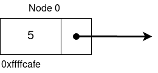
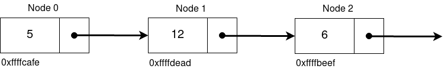

# Demonstrate understanding of linked lists

Code: [linkedlist.c](./linkedlist.c)

- What is a linked list?

    ```text
    ANSWER:
    ```

- Why would you use a linked list over an array?

    ```text
    ANSWER:
    ```

- What are the two main parts of a linked list?

    ```text
    1.
    2.
    ```



- A linked list with one element (or node) is diagramed above. What value should the arrow point to? Complete the table to reflect this.

| node address | node number | data | next |
|:------------:|:-----------:|:----:|:----:|
|              |             |      |      |



- Complete the table using the information in the diagram above.

| node address | node number | data | next |
|:------------:|:-----------:|:----:|:----:|
|              |             |      |      |
|              |             |      |      |
|              |             |      |      |

- [ ] Complete the TODOs in [linkedlist.c](./linkedlist.c)


References:

- [Linked list data structure](https://www.geeksforgeeks.org/data-structures/linked-list/)
