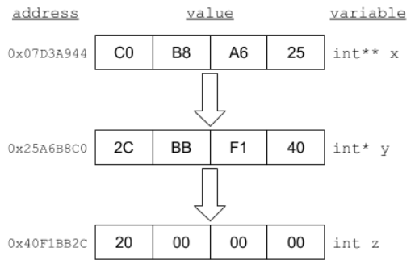

# Explain and demonstrate understanding of pointers in C

- What is a pointer?

    ```text
     ANSWER:
    ```

- What is the purpose of the `&` and `*` operators?  What do they do?

    ```text
     & :
     * :
    ```

- Describe the similarities and differences between a pointer and an array.

    ```text
     diffs:
     sims:
    ```

- Use your knowledge of pointers to find the values for each of the variables. (Note: remember endianness)

  

  ```c
    z =
   &z =
    y =
   &y =
   *y =
    x =
   &x =
   *x =
  **x =
  ```


References:

- Head First C 1st Edition, Dawn Griffiths, David Griffiths (Chapter 2 pg. 42)
- [Pointers I](https://www.learn-c.org/en/Pointers)
- [Pointers II](https://www.programiz.com/c-programming/c-pointers)
- [Pointer vs. Array](https://www.geeksforgeeks.org/pointer-vs-array-in-c/)
