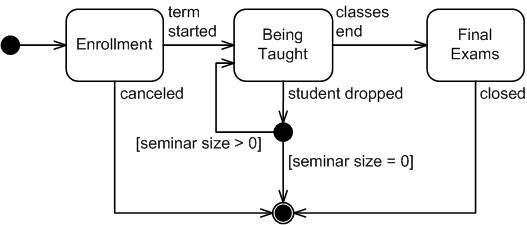

# Implement a State Machine with a signal handler

[Back to OVERVIEW](../../README.md)

## Purpose

This assignment is meant to introduce you to state machines and signal
handling in Linux.

## Assignment

### Part 1: State Machine Implementation

Implement a state machine with 2 states.
- The state machine should continuously cycle through the letters of the
  alphabet, printing one each second.
- In its initial state, the machine should print each letter in lowercase.
- In the other state, the machine should print each letter in uppercase.
- The machine should toggle between the states when it receives the
  `SIGTSTP` signal (generated by pressing Ctrl-z).
- Use the `signal` system call to register your signal handler (the man
  page recommends using the more portable sigaction, but don't worry about
  this unless you've got extra time and are extra motivated).

### Part 2: State Machine Diagram

#### Specification
A chess game consists of alternate moves of
Black and White:
- Each time someone moves, they say "Your move"
- White moves first
- The game can end both when it is White’s and when it is Black’s turn
- The moving player can end the game by:
  - Winning (checkmate)
  - Loosing (resign)
  - With a draw

You don't have to account for any chess rules not specifically mentioned in the above specification. E.g. it doesn't matter whether a player decides to move a Rook, or a King. It doesn't matter *where* they move *what* to. Etc.

#### Requirements
Given the above stateful specification for a game of chess, **draw a State Machine Diagram** that addresses the following:
- Show/Describe criteria necessary to change between each possible state
- Show/Describe the input/output generated during the change between each possible state
- Show/Describe the conditions necessary to be in the initial state
- Show/Describe the conditions necessary to be in the final state
- Show/Describe the relationship between each state in the program
- Account for any possible error conditions that may occur during state transitions

#### Submission
- Draw the above described state diagram either on paper or in your Diagram creation software of choice.
- Ensure you address each of the above mentioned requirements
- Take a screenshot of your diagram, and replace the below example state machine diagram with your own

Resources:
- [What is a state machine?](https://statecharts.dev/what-is-a-state-machine.html)
- [How to Program in Unity: State Machines Explained](https://www.youtube.com/watch?v=Vt8aZDPzRjI)
  - This is a fun video on how state machines apply to programming, specifically video game creation
  - Applicable to your learning up until the 9:50 mark

[Back to OVERVIEW](../../README.md)
