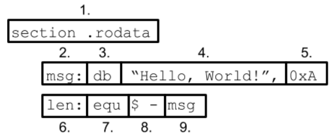

# Explain declaration of strings in assembly

- Explain the individual parts of the following lines of assembly:

   

  ```text
   1:
   2:
   3:
   4:
   5:
   6:
   7:
   8:
   9.
  ```

References:

- [NASM](https://www.nasm.us/doc/nasmdoc3.html)
- [Assembly strings](https://www.tutorialspoint.com/assembly_programming/assembly_strings.htm)
