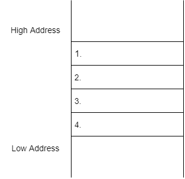

# Explain and diagram function calls in memory

- What is a stack frame?

```text

```

- Complete the x86 stack diagram using the wordbank.

    

Wordbank:
```text
ebp
eip
local variables
function parameters
```

```text
1.
2.
3.
4.
```

- How would Frame Pointer Omission (FPO) change what a stack frame looks like?  How does this work? Does x64 use FPO/rbp?

```text

```


- What does the `call` instruction do?

```text

```

- Install `gcc-multilib` using `sudo apt update; sudo apt install gcc-multilib`. This will allow you to compile C code into a 32-bit executable.

- Compile [`my_func.c`](./my_func.c) into a 32-bit executable by running `gcc -m32 -g -Wall -Wextra my_func.c -o my_func`.

- Run `myFunc` using gdb and break on `main`. Step until the `call myFunc` instruction (do not execute it yet).

```assembly
main:
   ...
   call   0x565554ed <myFunc>
   ...
```

- What are the values of `eip` and `esp`? What is the value that `esp` is pointing to right before the `call myFunc` instruction is executed?
  - Keep in mind that in gdb `eip` contains the instruction that will be executed next (ie it will update before the start of the `call` instruction)

```text
eip:
esp:
value at esp:
```

- In gdb step into (si) the `call myFunc` and show how the stack and the given registers change after the `call myFunc` instruction is executed.

```text
eip:
esp:
value at esp:
```

- What is the significance of the new value at `esp`?

```text

```


References:

- [Function calls](https://zhu45.org/posts/2017/Jul/30/understanding-how-function-call-works/)
- [FPO](http://www.nynaeve.net/?p=91)
