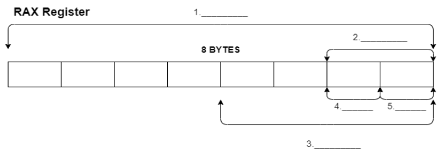

# Diagram the parts of a register

[Back to OVERVIEW](../../README.md)

- Complete the diagram using the wordbank.  Indicate the size of each.



Wordbank: `al`, `ah`, `ax`, `eax`, `rax`

  ```text
      1:
   size:

      2:
   size:

      3:
   size:

      4:
   size:

      5:
   size:
  ```

- Without using a calculator, what would each byte of `rax` contain (in hexadecimal) if its binary contents were:

+-----------------------------------------------------------------------------------------------+
| 1101 0011 | 1111 1010 | 1100 0011 | 1101 1101 | 0011 1100 | 0100 1111 | 1100 1010 | 1111 1110 |
+-----------------------------------------------------------------------------------------------+

```text
1.
2.
3.
4.
5.
6.
7.
8.
```

References:

- Intel Manual, Volume 1, pages 3-11 and 3-12.
- [x86 Assembly](https://en.wikibooks.org/wiki/X86_Assembly/X86_Architecture)
- [Binary to hexadecimal conversion](https://www.youtube.com/watch?v=tSLKOKGQq0Y)

[Back to OVERVIEW](../../README.md)
