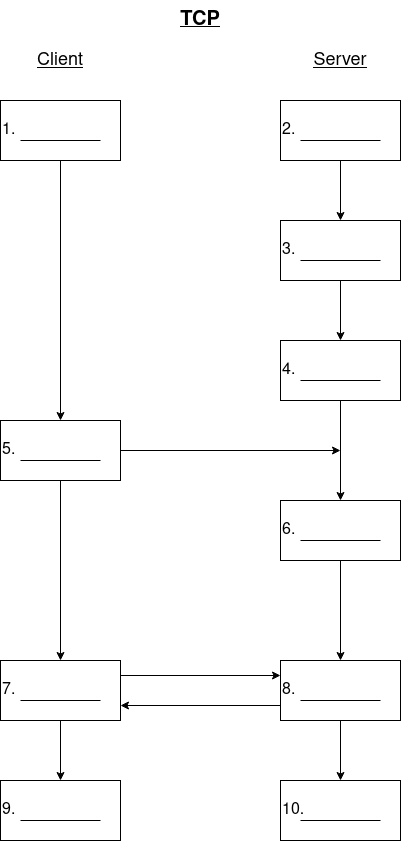

# Diagram the key steps of TCP socket communication

- Fill in the labels for setting up a TCP socket connection between a server and a client in C.  Each step should be labelled with its corresponding C function name.

  

  ```text
   1:
   2:
   3:
   4:
   5:
   6:
   7:
   8:
   9.
  10.
  ```


References:

- [Beej's guide to network programming](https://beej.us/guide/bgnet/html/)
- [Socket programming](https://www.geeksforgeeks.org/socket-programming-cc/)
