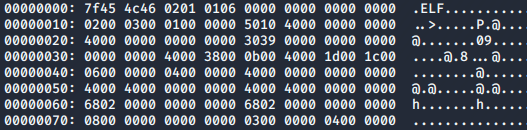

# Explain elf header format

- Utilize the following hexdump to fill in the missing fields of the `readelf` output
  - Note: Utilize `/usr/include/elf.h` to help parse the ELF

```text
00000000: 7f45 4c46 0201 0106 0000 0000 0000 0000   .ELF............
00000010: 0200 0300 0100 0000 5010 4000 0000 0000   ..>.....P.@.....
00000020: 4000 0000 0000 0000 3039 0000 0000 0000   @.......09......
00000030: 0000 0000 4000 3800 0b00 4000 1d00 1c00   ....@.8...@.....
00000040: 0600 0000 0400 0000 4000 0000 0000 0000   ........@.......
00000050: 4000 4000 0000 0000 4000 4000 0000 0000   @.@.....@.@.....
00000060: 6802 0000 0000 0000 6802 0000 0000 0000   h.......h.......
00000070: 0800 0000 0000 0000 0300 0000 0400 0000   ................
```



```text
1.
2.
3.
4.
5.
```


References:

- [ELF Overview and Analysis](https://linux-audit.com/elf-binaries-on-linux-understanding-and-analysis/)
- [man elf](https://www.man7.org/linux/man-pages/man5/elf.5.html)
