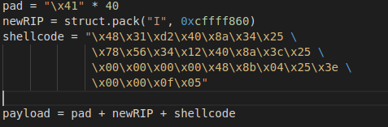

# Explain shellcode and related protection mechanisms

- What is shellcode? What purpose does it serve?

    ```text
    ANSWER:
    ```

- Explain how you can use shellcode with a buffer overflow?

    ```text
    ANSWER:
    ```

- How would the presence of NX/DEP cause issues with utilizing shellcode?

    ```text
    ANSWER:
    ```



- Are there any potential issues in the above shellcode if we are utilizing it in a buffer overflow that exploits `strcpy`? If yes, what are they?

    ```text
    ANSWER:
    ```


References:

- [Shellcode concepts](https://www.exploit-db.com/docs/english/13019-shell-code-for-beginners.pdf)
- [Buffer overflow with shellcode](https://0xrick.github.io/binary-exploitation/bof5/)
- [Modern binary exploitation](https://web.archive.org/web/20210413102355/http://security.cs.rpi.edu/courses/binexp-spring2015/lectures/11/07_lecture.pdf)
